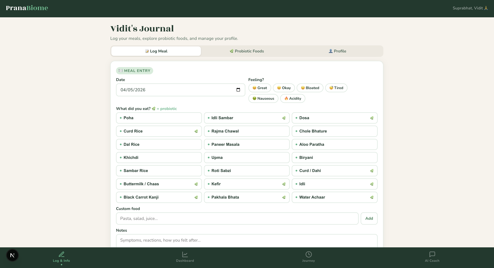
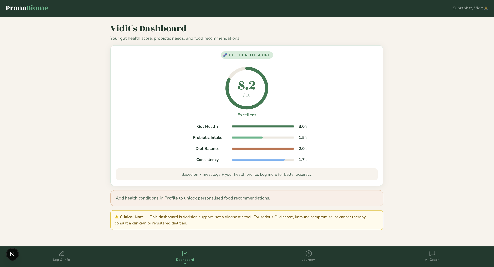
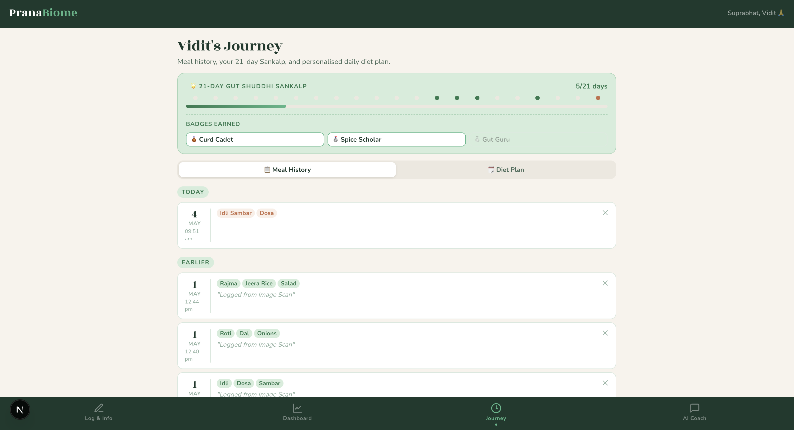
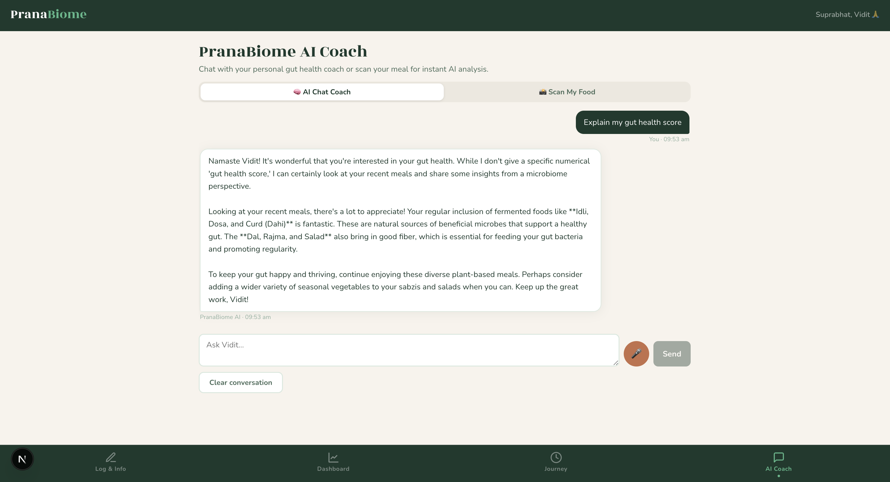
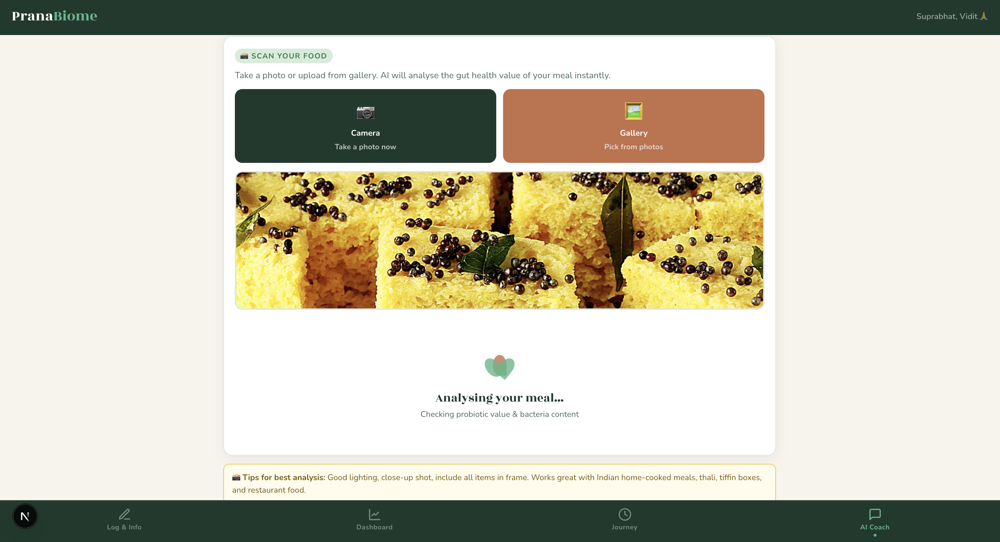
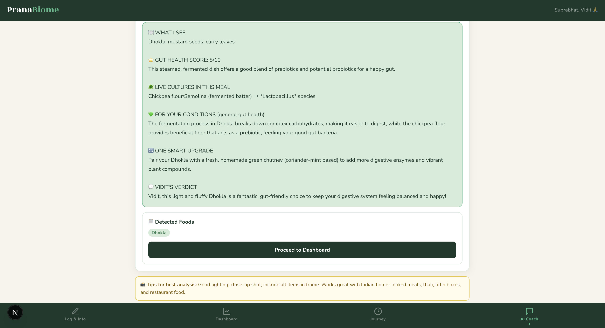

# 🌿 PranaBiome - Your Personal Gut Health Companion

> *"Built with Indian food wisdom, powered by modern AI."*

As a **Bioinformatics student**, I've always been fascinated by the gut microbiome, like how the trillions of bacteria that shape our digestion, immunity, and even mood. But most gut health apps are built around Western diets, with zero awareness of the fermented foods Indians have eaten for centuries.

**PranaBiome bridges that gap.**

It's a personalised gut health companion that helps you track probiotic intake, understand your gut health score, and get AI-powered coaching, all through the lens of familiar Indian foods like Idli, Curd Rice, Kanji, and Kefir.

---

## 📸 App Preview

| Log Meal | Dashboard | Journey |
|---|---|---|
|  |  |  |

| AI Coach | Food Scanner | Scan Result |
|---|---|---|
|  |  |  |

---

## ✨ Features

### 🥗 Smart Meal Logging
Log daily meals from a curated Indian food database. Probiotic-rich foods - Idli, Dosa, Curd/Dahi, Buttermilk/Chaas, Kefir, Water Achaar, Black Carrot Kanji, they automatically tagged with a 🌿 marker. Add custom foods and personal notes too.

### 💚 Gut Health Score Dashboard
A 4-axis scoring system that evaluates your gut health dynamically across:
- **Gut Health** — quality of foods logged
- **Probiotic Intake** — frequency of fermented food consumption
- **Diet Balance** — nutritional variety and spread
- **Consistency** — logging streak and regularity

### 🌟 21-Day Gut Shuddhi Sankalp
A gamified 21-day gut health challenge inspired by the concept of *Sankalp* (commitment). Earn cultural badges like **Curd Cadet**, **Spice Scholar**, and **Gut Guru** as you build healthy habits.

### 🤖 AI Chat Coach
An AI-powered gut health coach that analyses your recent meal logs and gives personalised, microbiome-aware advice with full understanding of Indian food culture and fermentation traditions.

### 📷 Scan My Food
Upload or capture a photo of your meal. The AI identifies the dish, scores its gut health value out of 10, identifies the live cultures and probiotic bacteria present, and suggests one smart dietary upgrade.

### 😊 Mood & Symptom Tracker
Log how you feel alongside every meal — Great, Okay, Bloated, Tired, Nauseous, or Acidity — to spot patterns between food choices and gut reactions over time.

---

## 🎬 How It Works

**Step 1: Log your meal**
Open the Journal tab and select what you ate from the Indian food database. Probiotic foods are pre-tagged. Add anything custom that isn't listed.

**Step 2: Track your mood**
Pick how your gut felt — the app connects food choices to physical reactions over time.

**Step 3: Check your Dashboard**
Your Gut Health Score updates dynamically based on your logs. Four sub-scores give you a clear picture of where you're doing well and where to improve.

**Step 4: Scan a meal (optional)**
Take a photo of your food — the AI analyses it instantly, identifies fermentation potential, names the live cultures, and gives a gut health score for that specific meal.

**Step 5: Talk to your AI Coach**
Ask anything gut-health related. The coach knows your recent meal history and responds with advice that actually makes sense for Indian diets.

**Step 6: Stay consistent**
The 21-day Sankalp tracks your streak. Hit milestones, earn badges, and build a habit that sticks.

---

## 🛠️ Tech Stack

| Layer | Technology |
|---|---|
| Framework | Next.js 14 (App Router) |
| Language | TypeScript |
| Fonts | Inter + Rozha One (Devanagari support) |
| AI / Vision | Google Gemini API |
| Platform | Web (localhost) |

---

## 🧠 What I Learned

- Designing a **multi-variable scoring algorithm** that weighs probiotic intake, dietary diversity, and consistency into a single, meaningful health metric
- **Prompt engineering** for an AI that genuinely understands Indian food culture and microbiome science
- Balancing **clinical responsibility** with engaging UX - the app clearly communicates it is a decision-support tool, not a diagnostic one
- Applying **Bioinformatics concepts** (microbiome diversity, fermentation, live bacterial cultures) into a real consumer-facing product

---

## ⚠️ Disclaimer

PranaBiome is a **decision-support tool**, not a medical or diagnostic application. For serious GI conditions, immune compromise, or cancer therapy please consult a qualified clinician or registered dietitian.

---

## 👨‍💻 Author

**Vidit Jain** — Bioinformatics Student

---

*⭐ If you found this interesting, drop a star — it means a lot as a student builder!*
